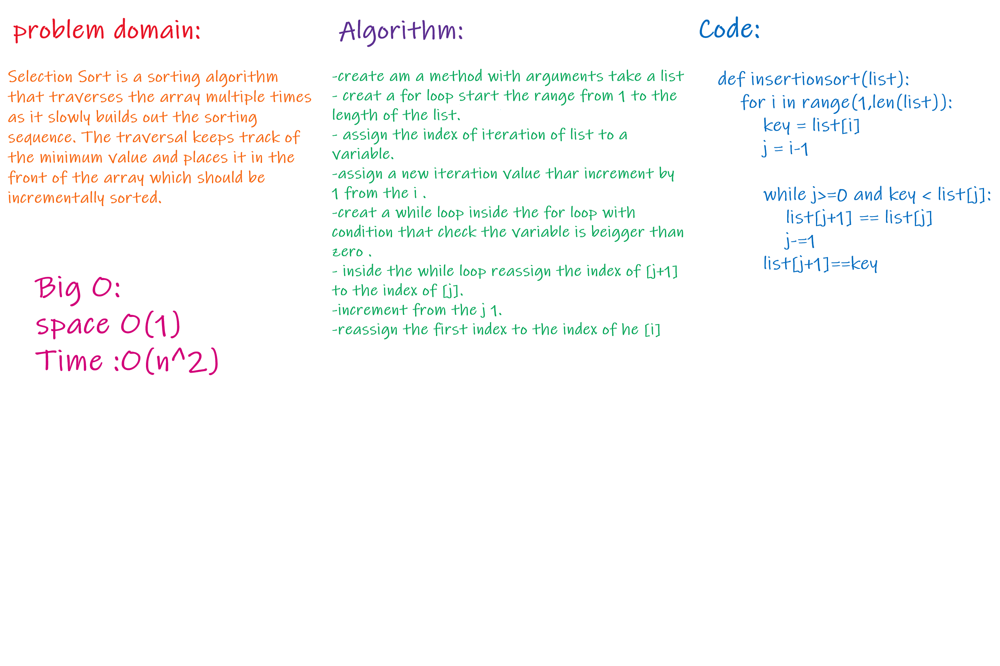

# Challenge Summary
Insertion sort is a simple sorting algorithm that builds the final sorted array (or list) one item at a time. It is much less efficient on large lists than more advanced algorithms such as quicksort, heapsort, or merge sort.

## Challenge Description
the challenge is to sort any integer arraey by the method that take an list as argument, it was good practice .

## Approach & Efficiency
Space complexity Big O(1)
Time complexity Big O(n^2)

## Solution

