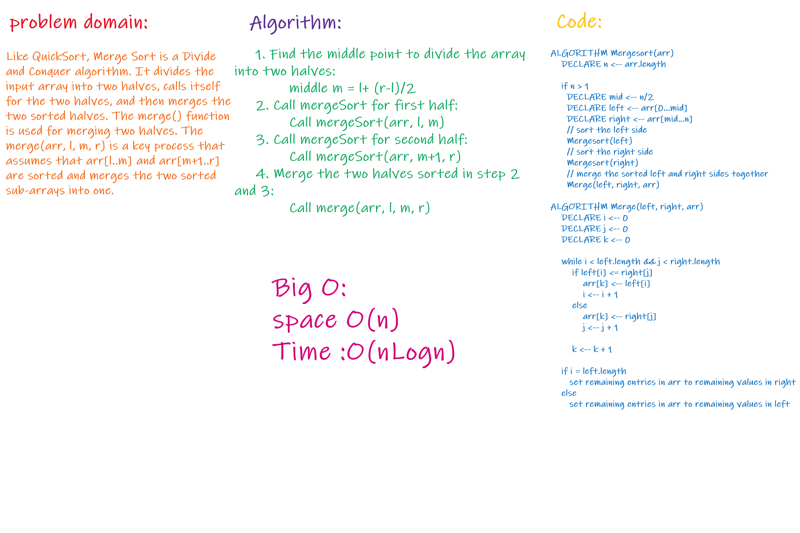

# Challenge Summary

Merge sort is a sorting technique based on divide and conquer technique. With worst-case time complexity being Ο(nlogn), it is one of the most respected algorithms.
Merge sort first divides the array into equal halves and then combines them in a sorted manner.

## Challenge Description
Review the pseudocode below, then trace the algorithm by stepping through the process with the provided sample array. Document your explanation by creating a blog article that shows the step-by-step output after each iteration through some sort of visual.

## Approach & Efficiency

Space complexity Big O(n)
Time complexity Big O(nLogn)

## Solution

