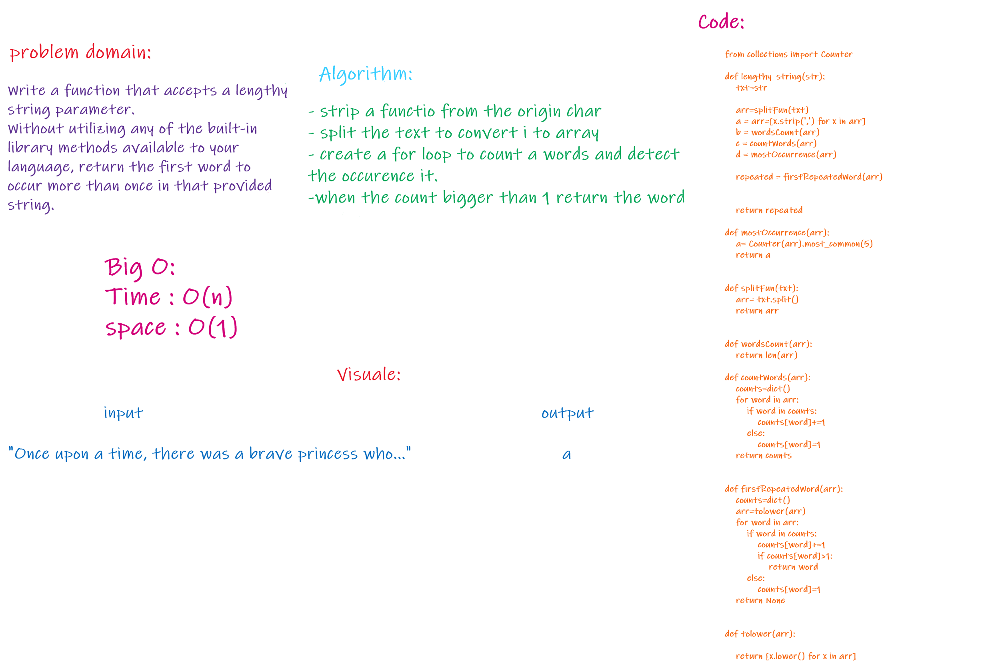

# Challenge Summary
Write a function that accepts a lengthy string parameter.
Without utilizing any of the built-in library methods available to your language, return the first word
to occur more than once in that provided string.

## Challenge Description
define a function to split a string to array with the word of string then sort every word in hashtable it the value repeated return it directly

## Approach & Efficiency
 time: O(n)

## Solution

