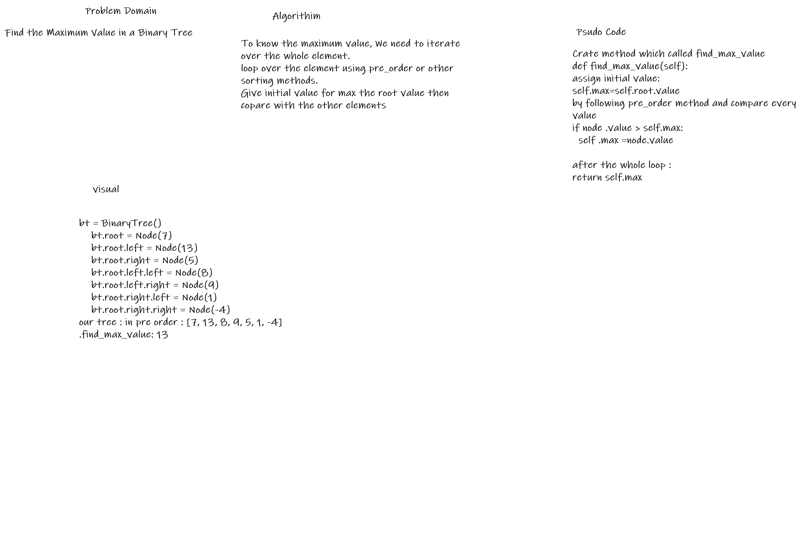

# Challenge Summary
<!-- Short summary or background information -->
Creat a Binary tree that store data in in tree. 
Craet Binary search Tree that store data in by order and can easly to find
Creat a method that find the maximum value assumming that all the values are numbers

## Challenge Description
<!-- Description of the challenge -->
using the old tree which has been created in Challeng 15

Add a new method that called find_maximum_value

## Approach & Efficiency
<!-- What approach did you take? Why? What is the Big O space/time for this approach? -->
How we can traveres over the data in an ew way rather than the stack and queue and linked list
How to finf the maximum value

## Solution
