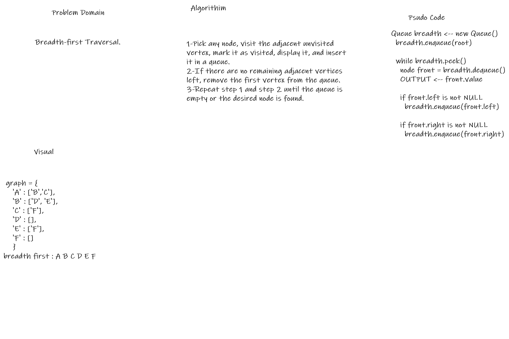

# Challenge Summary
<!-- Short summary or background information -->
Creat a Binary tree that store data in in tree. 
Sort the data in breadth_first

## Challenge Description
<!-- Description of the challenge -->
using the old tree which has been created in Challeng 15

Add a new method that called breadth_first

## Approach & Efficiency
<!-- What approach did you take? Why? What is the Big O space/time for this approach? -->

How to sort data in diffirent way and use queue with tree

## Solution
<!-- Embedded whiteboard image -->
